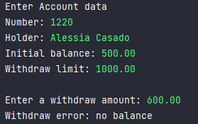

# :sparkles:About the project:sparkles:

Do a program that read data from a bank account and after
that, make a withdraw in this account, showing the new balance.

#### :triangular_flag_on_post:Attention to the exceptions
A withdraw can't happen if there is no balance in the account,
or if the withdraw amount is higher to the balance's withdraw limit.

#### :sparkles:Diagram:sparkles:

    

#### :sparkles:Output:sparkles:

#### :sparkles:Output exception No balance:sparkles:

#### :sparkles:Output exception withdraw limit:sparkles:
